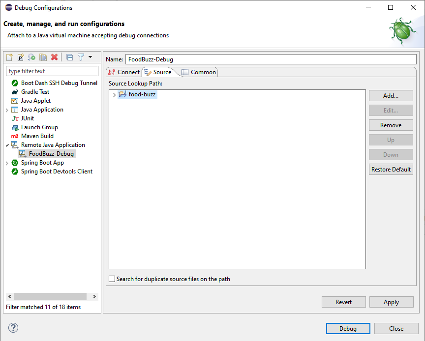
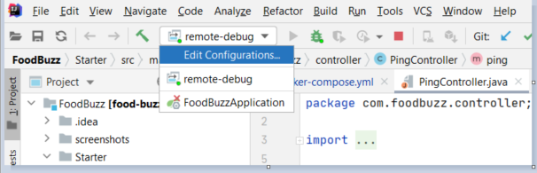
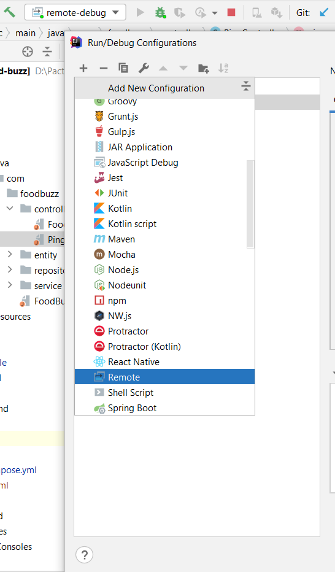
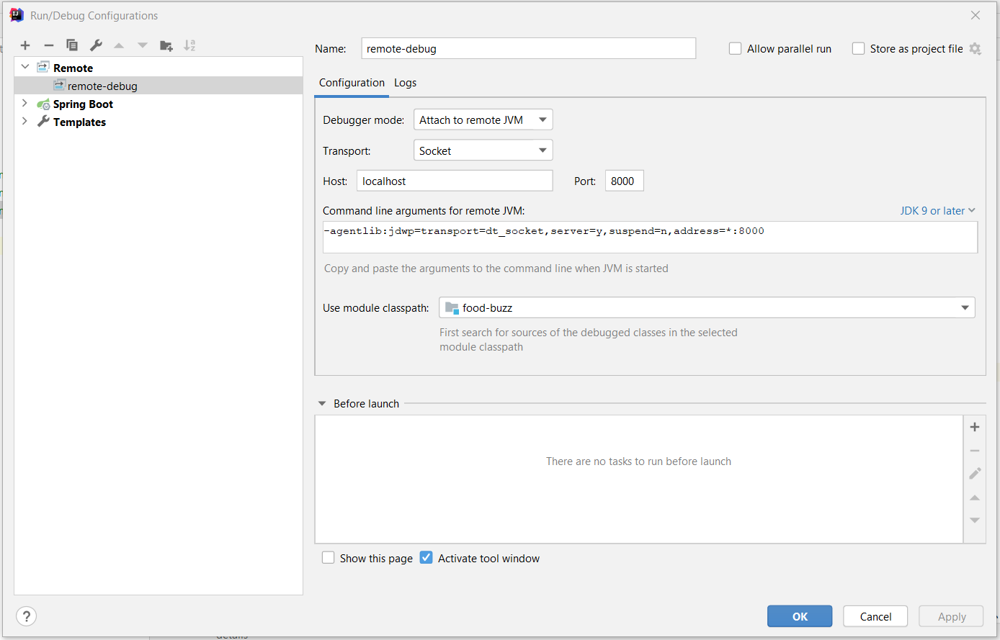
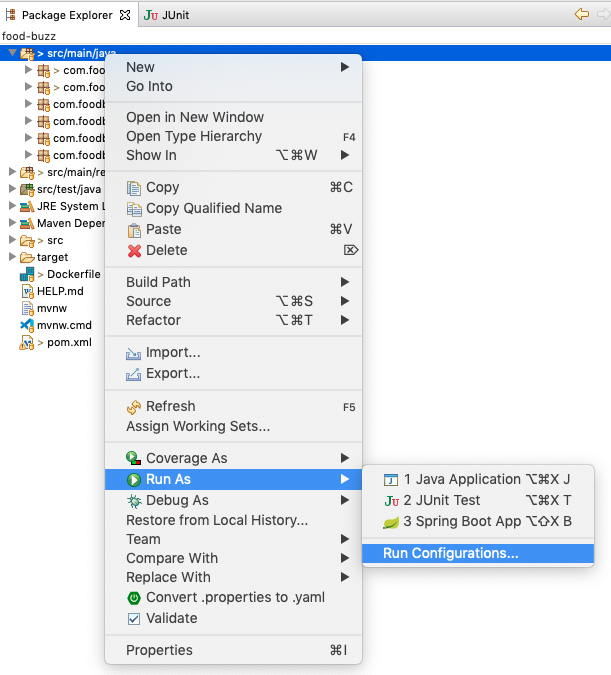
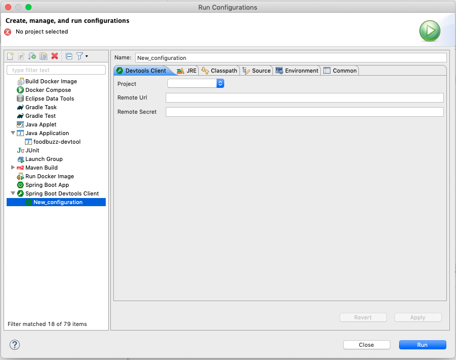
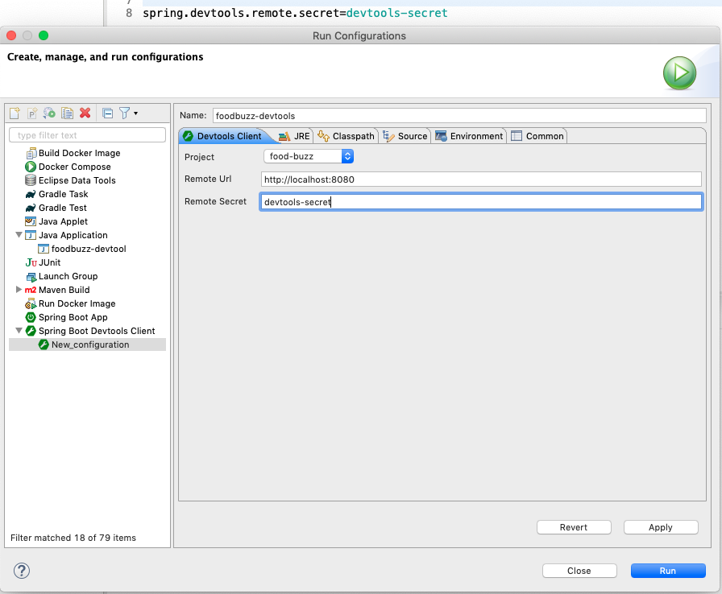
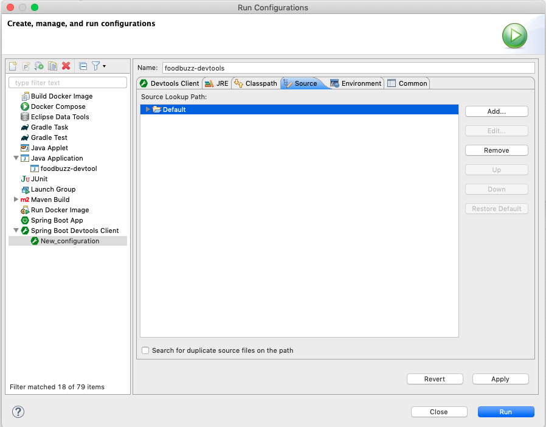
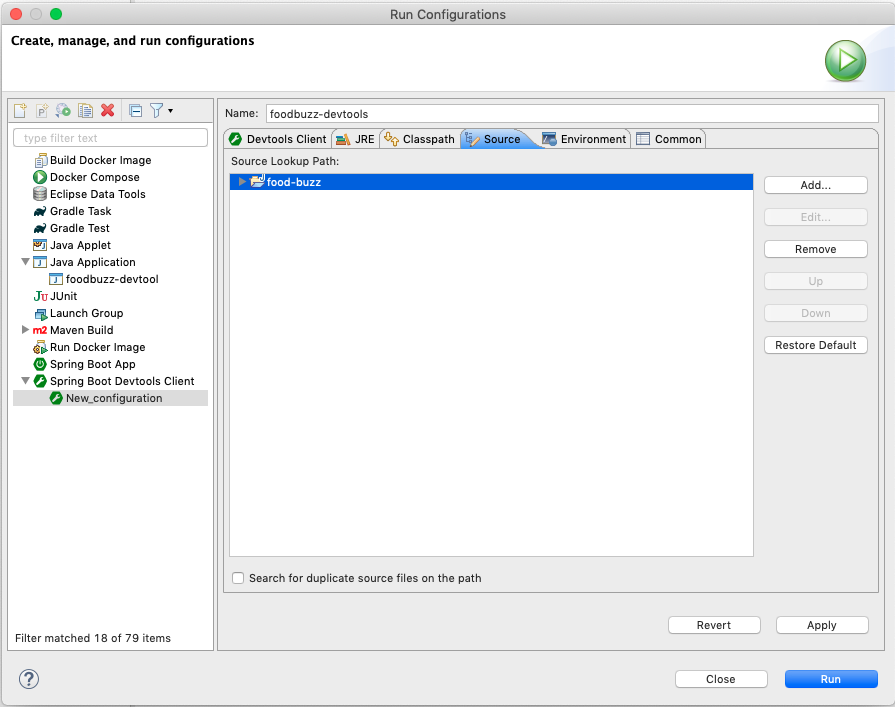
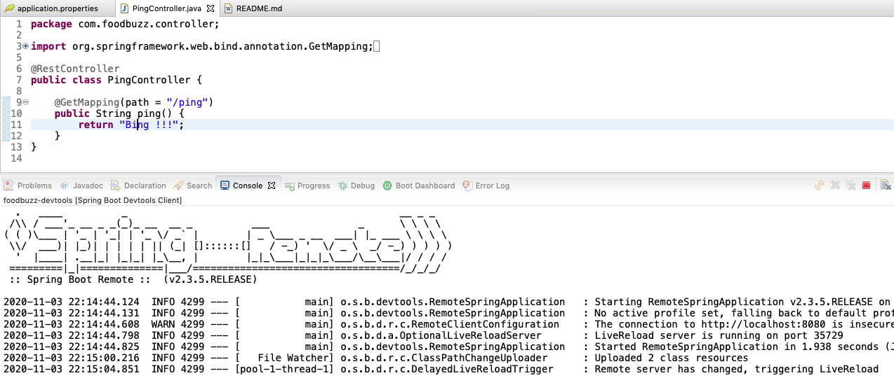

# FoodBuzz

This is a sample application demonstrating the containerisation of spring boot application in development environment. In this project we will look at very basic rest service, fetching data from mysql database. Rest application service and database both will be running within a container build on docker. We will also look at remote debugging and reload container via spring boot dev tools for this containerised application.

```pre
	|---------|			|----------|
	|	  |			|	   |
	|FoodBuzz |			|   Mysql  |
	|Container|			|Container |
	|	  |			|	   |
	|---------|			|----------|
```

## Goal:

This repository is for two achieve two main goals

  - Debugging a java application running inside a container.
  - Live reloading the foodbuzz application using spring boot-devtools.


## Running the starter application:

Before running the application, clone the application in your local system

```bash
git clone https://github.com/ratulSharker/FoodBuzz
```

Get into the `Starter` project folder

```bash
cd FoodBuzz/Starter
```

We use `maven` as a build tool, so make sure `maven` is installed in your system. To install maven in your system please follow these [instructions](https://maven.apache.org/install.html).

Now build the **FoodBuzz** using `maven`

```bash
mvn clean package
```

We can find the jar file inside the `target` directory.

Now we are able to run the `docker-compose` to `up` the whole application as following

```bash
cd ../ 	# move to the parent `FoodBuzz` directory
docker-compose up -d
```

doing `docker-compose up -d` will respond with following

```bash
Creating network "foodbuzz_db-net" with the default driver
Creating db ... done
Creating fb ... done
```

Here **db** is our containerized mysql db service. **fb** is FoodBuzz service. Both these service is connected inside **db-net** network declared in `docker-compose` file.

Once these two services are up, it can be accessed via `cURL` as follows

```bash
curl -X GET http://localhost:8080/foods
```

(NB: **fb** service is dependent upon **db** service. To up and running **db** service may take longer time than usual, so it accessing the service may require some time even both services are up and running. To check if both service are actually up or not omit `-d` in the `docker-compose up -d` to see the logs of these services.)

## Remote debugging the FoodBuzz application:

<details>
	<summary><b>Application Setup</b></summary>
<br>

To debug the **FoodBuzz** application remotely, we need to pass some additional parameters while running the **FoodBuzz** jar inside the container. For more information please reffer to this [guide](https://www.baeldung.com/java-application-remote-debugging)

Open the `Dockerfile` inside the `Starter` directory and change below line

```dockerfile
ENTRYPOINT ["java", "-jar", "/food-buzz.jar"]
```

with following

```dockerfile
ENTRYPOINT ["java", "-agentlib:jdwp=transport=dt_socket,server=y,suspend=n,address=*:8000", "-jar", "/food-buzz.jar"]
```

Doing so, our **FoodBuzz** jar will run in debug mode. We use port `8000` for debugging commuinication. So we also need to `expose 8000` in `dockerfile`.

```dockerfile
EXPOSE 8000
```

besides this, also update the `docker-compose` to expose `8000` port into the host machine

```dockerfile
services:
 foodbuzz:
  build: ./Starter
  image: foodbuzz
  container_name: fb
  ports:
   - "8080:8080"
   - "8000:8000"		# <---- debugging port mapping to host machine
  networks:
   - db-net
  depends_on:
   - db
```

Now stop the previously running `docker-compose` by following (if it is still running)

```bash
docker-compose down
```

Now re-run the `docker-compose` specifying that it should rebuild the **FoodBuzz** image by running following. (Make sure you are in the `FoodBuzz` directory before running `docker-compose` commmand.)

```bash
docker-compose up -d --build		# --build option will rebuild the FoodBuzz image.
```

Now we are ready to connect the ide (eclipse, inteliJ, Visual studio code) to this debugger.
</details>

<details>
<summary><b>Connect eclipse remote debugger to FoodBuzz</b></summary>

#### Step 1:
To connect remote debugger in eclipse right on the **FoodBuzz** project. Navigate to

```
'FoodBuzz Project' > Debug As > Debug configurations...
```


#### Step 2:
Now move to the `Remote java Application` in the popup window


#### Step 3:
Then create a new debug configuration. Make sure following things

 - Connection-Type is set to `socket attach`
 - host to `localhost`
 - port to `8000` (this port is the debugging port set in the Dockerfile for debugging )
 


#### Step 4:
Now move to the `source` tab, remove the `Default` folder


#### Step 5:
Set the **FoodBuzz** project folder




#### Step 6:
Then click the `Apply` and then start debugging by clicking the `Debug` button. At this point i assume our `docker-compose` is up and running in debugging option in place. Now we will set a breakpoint inside `FoodController`.


#### Step 7:
Now hitting the `/foods` endpoint will start the debugging procedure


</details>


<details>
<summary><b>Connect VS Code remote debugger to FoodBuzz</b></summary>
<br/>

Switch to run and debug tab and create `launch.json`. This `launch.json` will contain all the run configuration. For remote debugging add the following:

```json
{
    "type": "java",
    "name": "Debug",
    "request": "attach",
    "hostName": "localhost",
    "port": 8000
}
```

Bottom right `Add Configuration...` button may help in case of generating this `attach` type configuration. Run this configuration as debug mode, you will be connected to **FoodBuzz** application debugee.

</details>

<details>
<summary><b>Connect Intellij remote debugger to FoodBuzz</b></summary>

#### Step 1:
To connect remote debugger in Intellij right on the **FoodBuzz** project. Navigate to

```
Click Edit Configuration
```



#### Step 2:
Now click plus `(+)` sing and select `Remote` in the popup window



#### Step 3:
Then put the `Name, Port and select Use module classpath`. After that please click the `Apply` button and the `OK` button.



</details>


## Live reload using spring boot dev-tools:

<details>
	<summary><b>Application setup</b></summary>
<br/>	

At first spring boot dev-tools related class files needed to be shipped with the **FoodBuzz** application jar. To include dev-tools related class files we need to configure `pom.xml`.

In `pom.xml` file replace

```xml
<plugin>
	<groupId>org.springframework.boot</groupId>
	<artifactId>spring-boot-maven-plugin</artifactId>
</plugin>
```

with 

```xml
<plugin>
	<groupId>org.springframework.boot</groupId>
	<artifactId>spring-boot-maven-plugin</artifactId>
	<configuration>
		<excludeDevtools>false</excludeDevtools>
	</configuration>
</plugin>
```

In the `application.properties` declare following

```properties
spring.devtools.remote.secret=devtools-secret
```

Now we need to build the jar again using following (make sure you are in the `Starter` directory)

```bash
mvn clean package
```

Then rebuild the images (make sure you are in the `FoodBuzz` directory)

```bash
docker-compose up --build -d
```
</details>

<details>
<summary><b>Connect eclipse spring boot devtools live reload client</b></summary>
<br/>

NB: To continue with this integration eclipse plugin STS (Spring tool suite) must be installed.

#### Step 1:

Right click on the **FoodBuzz** project and goto

```
Run As > Run Configurations...
```



#### Step 2:

Create new spring boot devtools client




#### Step 3:

Set name, project, remote url, remote secret here. Following things to keep in mind

 - remote url is the url where the application can be accessed.
 - remote secret is the secret set in the `application.properties`.




#### Step 4:

Switch to `Source` tab and remove the `Default` source folder.




#### Step 5:

In the `Source` tab, add **FoodBuzz** source



#### Step 6:

Apply and run the configuration



</details>

<details>
<summary><b>VS Code configuration spring boot devtools live reload client</b></summary>

<br/>
All we need to configure a java launch configuration for spring boot dev tool client application. These [guides](https://docs.spring.io/spring-boot/docs/2.3.5.RELEASE/reference/html/using-spring-boot.html#running-the-remote-client-application) can help setting things up. In the VS code `launch.json`, add following configuration

```json
{
    "type": "java",
    "name": "Devtools",
    "request": "launch",
    "mainClass": "org.springframework.boot.devtools.RemoteSpringApplication",
    "args": "http://localhost:8080"
}
```

Run this configuration without debug mode.

</details>
